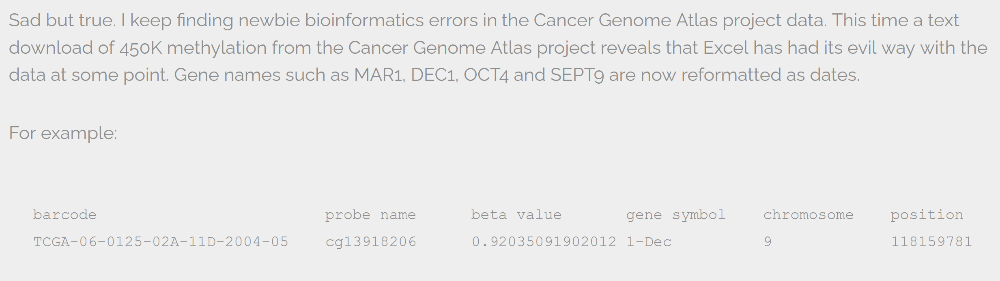
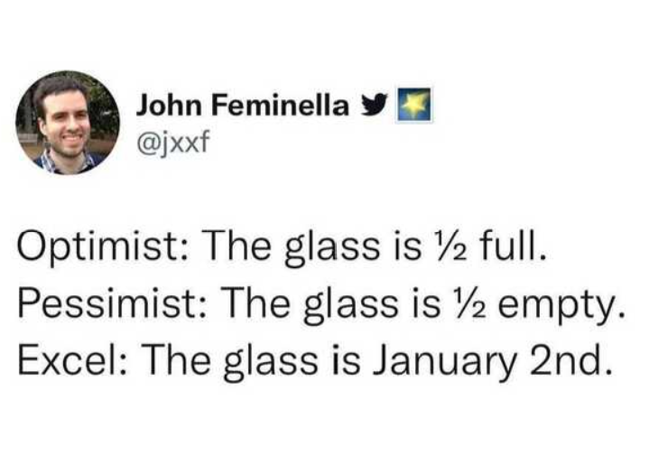
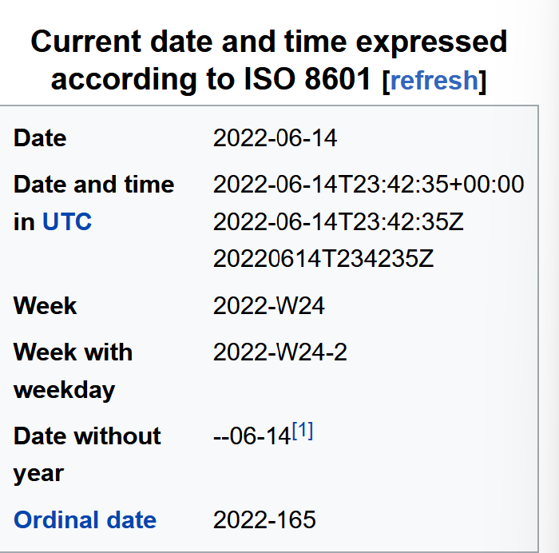
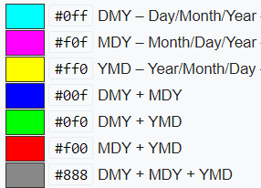

# Dates are finicky

## Dates in Excel
Date formats in excel need special attention. There are many numerous “useful features” which allow them to handle dates in a variety of ways.

There are different ways to visualize a date and as you work on your spreadsheet, the format may change unintentionally due to these features. Example: 

Those visualizations of dates are valid for a given spreadsheet program (be it LibreOffice, Microsoft Excel, OpenOffice, Gnumeric, etc.) are usually guaranteed to be **compatible only within the same family of products**. 

Additionally, Excel can **[turn things that aren't dates into dates](https://nsaunders.wordpress.com/2012/10/22/gene-name-errors-and-excel-lessons-not-learned/)**, for example names or identifiers like MAR1, DEC1, OCT4. So if you're avoiding the date format overall, it's easier to identify these issues. 

## What you see is not what everyone gets...

Behind the scenes excel stores a date as numbers, which allows you to make calculations with dates as well as making plots

Essentially, it counts the days from a default of December 31, 1899, and thus stores July 2, 2014 as  the **serial number** 41822.

This serial number thing can actually be useful in some circumstances. By using the above functions we can easily add days, months or years to a given date. Say you had a sampling plan where you needed to sample every thirty seven days. In another cell, you could type:

 July 2, 2014 = 41822

    =B2+37

And it would return

    8-Aug

because it understands the date as a number `41822`, and `41822 + 37 = 41859` which Excel interprets as August 8, 2014. 

Take home message working with excel dates: 

All excel cells have a value in them that have a format on top of them which is what you see. This has implications when you want to share your data. 

* When you open a file in excel, it sometimes tries to interpret data as dates, sometimes it interprets the wrong format. 
* When opening excel files in other programs, that program might not interpret the format correctly. For example, opening an excel file in python will show the integer/number value of that cell, rather than the date. 

## Best Practices in Date Formatting?

There are several solutions to get around this, which depends on the way that you are using dates. As long as it is **described and consistent in your date column**. 

* year, month day in separate columns
* year, day of year in separate columns
* Storing dates as a single string:  Another alternative could be to convert the date string
  into a single string using the `YYYYMMDDhhmmss` format.
  For example the date `March 24, 2015 17:25:35` would
  become `20150324172535`, where:

​		YYYY:   the full year, i.e. 2015  
​		MM:     the month, i.e. 03  
​		DD:     the day of month, i.e. 24  
​		hh:     hour of day, i.e. 17  
​		mm:     minutes, i.e. 25  
​		ss:     seconds, i.e. 35  

Such strings will be correctly sorted in ascending or descending order, and by knowing the format they can then be correctly processed by the receiving software.

> ## Balancing the needs of analysis, preservation and data reuse. 
> If you need to use other date formats during your analysis, make sure to use a best-practice format when sharing your data and exporting final data for preservation (more on exporting later).
{: .callout}

## ISO 8601 Standard

ISO 8601 is an international standard covering the communication of date and time related data. (Source wikipedia)

Standards in date and time notation are very important. For example the todays date June 15, 2022 is written in America as 06/15/22, while in Canada it is written as 15/06/2022. 

## Whatever format you decide to use, document it

Documenting the format you use is very important.  If you share your data in Excel or another program, the person recieving your data can verify what they see is what you intended if you write down the format.

> Example: Ambiguous dates
> 
> You have a date in your dataset **11/4/12**.
> - In America you may assume this is **November 4th, 2012**.
> - In Europe you may assume this is **April 11th, 2012**.
> - In Japan you may assume this is **April 12th, 2011** 
>
> To be FAIR you have to think globally.  
>
> 
* image by Artem Karimov,TopoChecker (2019)

> ## Don't forget about time zones!
>
> If you record times, document the time zone it is in.  Is it your local time zone? What is that? Is it in Universal Time Coordinated (UTC)? [More about UTC and GMT](https://www.nhc.noaa.gov/aboututc.shtml)
> 
> > - UTC time zone is the standard used for instruments on oceanographic cruises.  Imagine traveling back and forth across different time zones during your research.  You don't want your time series to jump to different local times!  That makes using the data so difficult and sometimes impossible.
{: .callout}
