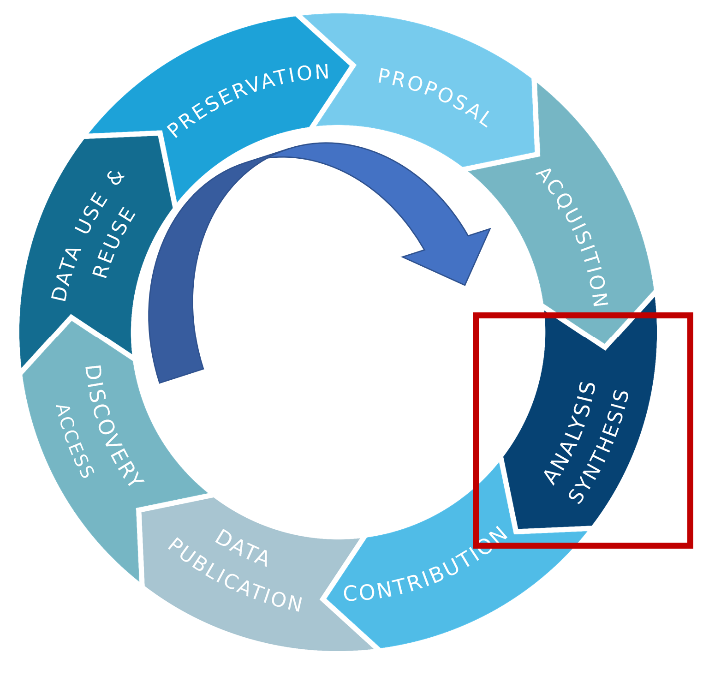

## Where are we?

In the previous lesson we touched on capturing provenanec and metadata while you clean your own dataset.  But now we are talking about what you can do during the Analysis phase of a data life cycle to implement FAIR practices.

## What is Provenance?

> ### [Definition from Miriam-Webster Dictionary](https://www.merriam-webster.com/dictionary/provenance):
> - Origin, Source.
> - The history of ownership of a valued object or work of art or literature

Provenance was orignially a term applied to works of fine art as a record of its history. It came to encompas not just chain of custody, but a full record of what happened to it and where it traveled. The term is now applied to data as well, and the meaning is the same.  Where did a dataset come from?  Who created it? What processing was done to it? Where was it stored?

<figure>
        

        <figcaption>Water Lilies, Monet (1919), photo by Szilas in the Metropolitan Museum of Art (2008). <a href="https://commons.wikimedia.org/wiki/File:Water_Lilies_(Monet,_1919).JPG">Image source: Wikipedia</a></figcaption>
</figure>

> ### The parallels between "artwork" and "data" still hold up today.
>
> From ["artworkarchive's "Provenance 101"](https://www.artworkarchive.com/blog/provenance-101-how-to-record-the-history-of-a-work-of-art):
>
> - _"An ideal provenance captures the ownership history of an artwork all the way back to the creation of the artist. But, many times there are gaps in the object's ownership record which can affect the work's value. "_
> - _ "Don't make your artworks worthless by losing important information. "_
{: .callout}

Have you ever come back to plots or data you created and have no idea how you make them? At that point the provenance is gone.  You can't go back in time and collect some kinds of metadata. You have to keep good notes and records while you work with your data.

## What to keep in mind when writing a provenance record

- **Document where you get your source data** so you can cite it later.  If you collected it yourself, make sure you have all the metadata about how, when, and where you collected it. Keep notes about what processing you do to the data. 
- **Keep your source data separate from your analysis tables**. Never manipulate your source data during your analyses! Make a separate copy for manipulating however you need to during the analyses. Make a system to keep track of your workflow and identify different data tables.  This can be a formal version control system (e.g. git/github) or a documented plan for folder and file naming conventions along with notes.
- **Write notes like you are explaining it to someone else.**  Look at your plots and data and pretend you are stepping someone else through how you would produce the same thing.  Even if you come back to it yourself in the future, it's likely you would have forgotten all the details. Help yourself out with good documentation.
- **Record the filename and path you save to.** Make it clear what was done to produce each file. 

> Example notes:
> 
> 2022-06-22: 
> Downloaded a subset of dataset "Niskin bottle samples" which spans 2004 to 2008 to folder "BATS_niskin/orig/bcodmo_dataset_3782_2004_to_2008.csv"
> 
> data source citation:
> Johnson, R. (2019) Niskin bottle water samples and CTD measurements at water sample depths collected at Bermuda Atlantic Time-Series sites in the Sargasso Sea ongoing from 1955-01-29 (BATS project). Biological and Chemical Oceanography Data Management Office (BCO-DMO). (Version 1) Version Date 2019-05-29 [Subset 2004 to 2008]. http://lod.bco-dmo.org/id/dataset/3782 [Accessed on 2022-06-22]
>
> Data were binned data by hour, ordered table by station, cast, pressure and saved to "BATS_niskin_2004_to_2008/hourly/BATS_niskin_hourly.xlsx" 
> * exported Sheet 1 to "BATS_niskin_2004_to_2008/hourly/BATS_niskin_hourly.csv." 
> * exported plot in Sheet 2 to "BATS_niskin_2004_to_2008/hourly/BATS_profiles.png"

Having clear records about how a plot was produced with the table you used to produce it is very important for reports and journal publications.  It allows your results to be reproducible, transparent, and fascilitate peer review. It also makes writing your publication easier since you already have the figure captions written!
