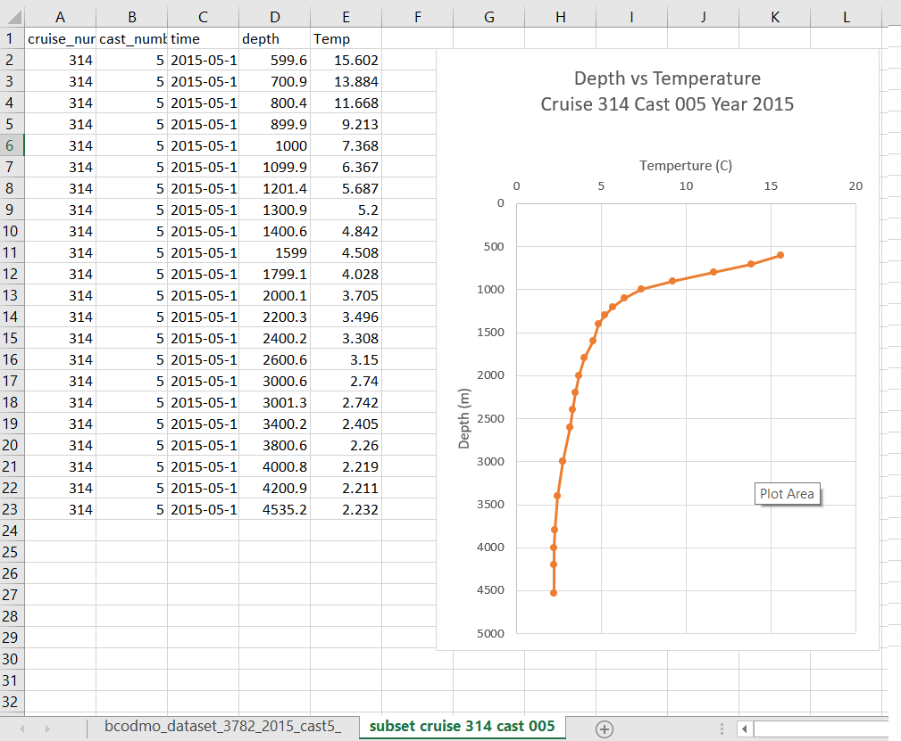

> ## Live Demo: Download a dataset, write provenance during analysis.
>
> - Subset dataset "Niskin bottle samples" [https://www.bco-dmo.org/dataset/3782](https://www.bco-dmo.org/dataset/3782)
> - Click the `Subset Data` button at the top of the page.
> - Download a subset of this dataset containing cruise 314, cast 005.
>
> ## Solution
> Open a text editor and write down every step you take.  Make sure to write the date you are handling the data.
> 
> You can use [this link to download the subset of data for the exercise from BCODMO](https://erddap.bco-dmo.org/erddap/tabledap/bcodmo_dataset_3782.csv?cruise_type%2Ccruise_type_text%2Ccruise_number%2Ccast_number%2Cdecy%2Ctime%2Clatitude%2Clongitude%2Cfilename%2CId%2Cdepth%2Cniskin_number%2Cp1%2Cp2%2Cp3%2Cp4%2Cp5%2Cp6%2Cp7%2Cp8%2Cp9%2Cp10%2Cp11%2Cp12%2Cp13%2Cp14%2Cp15%2CChl%2CPhae%2Cp18%2Cp19%2Cp20%2Cp21%2CTemp%2CCTD_S%2CSal1%2CSigTh%2CO2%2COxFix%2CAnom1%2CCO2%2CAlk%2CNO31%2CNO21%2CPO41%2CSi1%2CPOC%2CPON%2CTOC%2CTN%2CBact%2CPOP%2CTDP%2CSRP%2CBSi%2CLSi%2CPro%2CSyn%2CPiceu%2CNaneu%2CNO3%2CNO2%2CPO4%2CSi%2CPres&cruise_number=%220314%22&cast_number=%22005%22&decy%3E=2015&decy%3C2016): 
>  OR you can [download the csv file from this lesson](https://raw.githubusercontent.com/BCODMO/workshop_bios_oceanographic_data_reuse/gh-pages/files/bcodmo_dataset_3782_2015_cast5_cruise314_orig.csv)
> {: .solution}
{: .challenge}

> > # Next steps
> > - Make a new sheet for the data you change during your analysis.
> > - Invert the depth axis since depth of 0 is the surface.
> >
> >  

## Anyone can create metadata

You don't need any special skills to write metadata and documentation to keep track of your provenance.  

However, there are specifications and tools you can learn that have huge benefits.   See more about metadata specifications like [PROV](https://www.w3.org/2001/sw/wiki/PROV).

**Version control** (e.g. git/github) is a great way to keep track of all the changes in your files.  It does have a learning curve but will save you time and frustration in the long run after you learn it. 

I'm sure everyone has experienced this frustration:

> from: Wit and wisdom from Jorge Cham (http://phdcomics.com/)

Git will keeps track of all the differences in your files over time, no need to keep a million copies!  You can make notes for each version of your files too.

> Learn more about [Version Control and Git in a Software Carpentry](https://swcarpentry.github.io/git-novice/).

## Open new doors with a programming language

Like version control, learning a programming language has a learning curve.  But the benefits after you learn it will be substantial.  It will open up a lot of doors for your current research, and you will have a valuable skill that is in demand in many fields including research.

There are many resources online for learning a programming language, but you can check out the "Software Carpentry" lessons which https://software-carpentry.org/lessons/

> ## Python Example
> An example python notebook that is fully reproducible that does the exact same thing we just did manually to create that plot.
> [BATS niskin subset example notebook](https://gist.github.com/adyork/2bc800067156b54fab855c389bd1a163#file-bats_niskin_subset_example-ipynb)
> And my text.
> {: .callout}
>
> 
